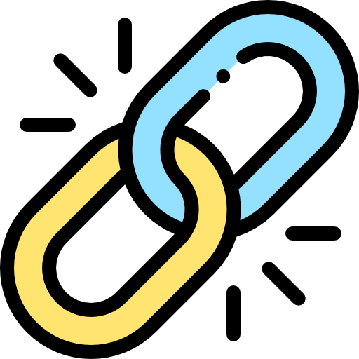
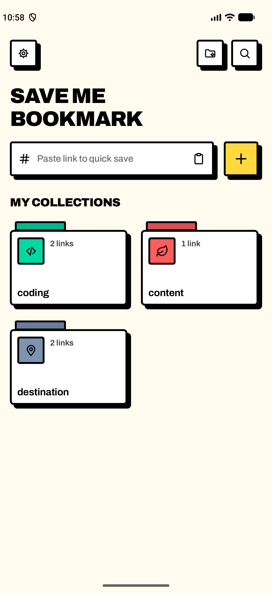
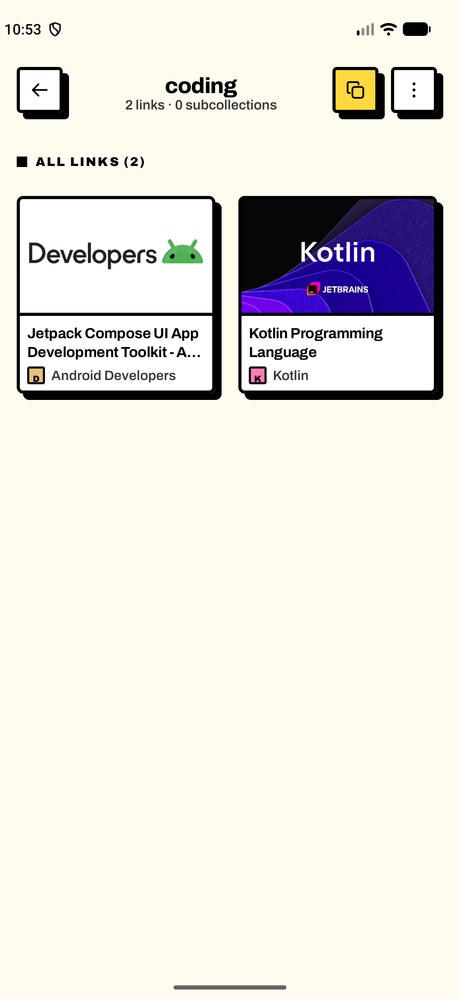
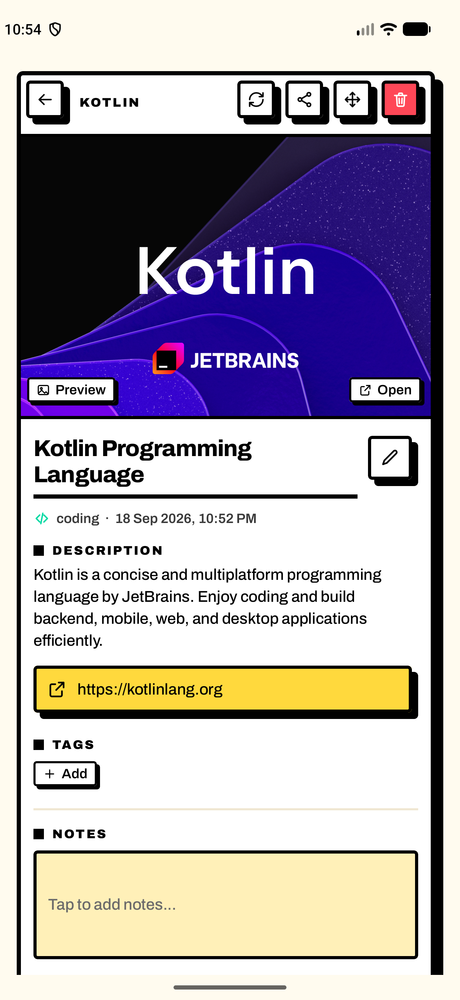
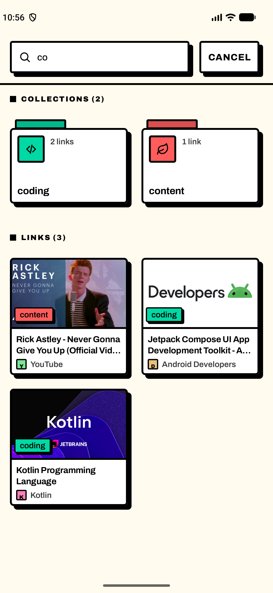
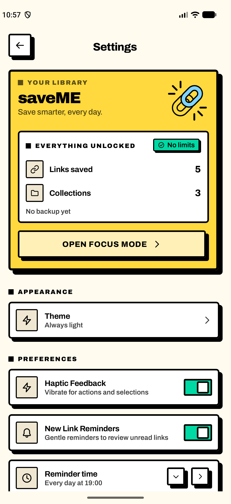
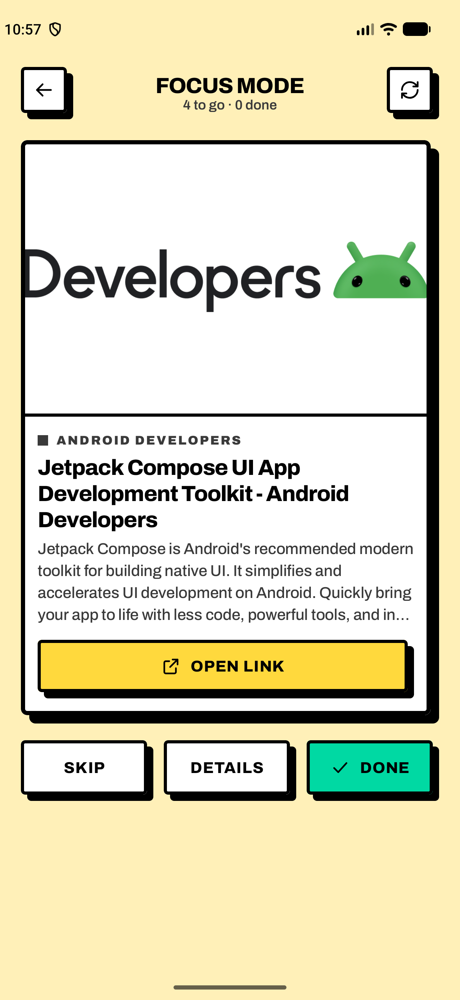
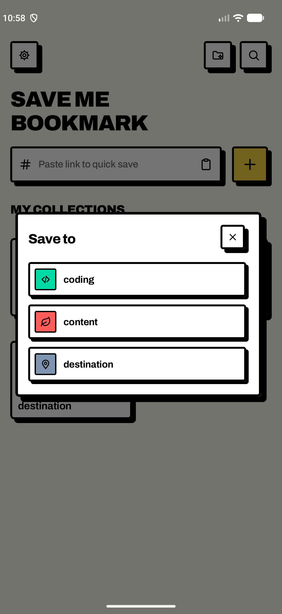

<div align="center">



# saveME

### Simpan tautannya sekarang. Baca kalau sempat.

**Penyimpan tautan untuk Android yang seluruh isinya tinggal di ponsel Anda.**
Tanpa akun. Tanpa server. Tanpa layar berlangganan yang muncul di tengah jalan.

<br>


</div>

<br>

---

## Sepuluh detik pertama

Anda sedang menggulir Instagram. Ada satu unggahan yang ingin disimpan. Tekan
*Share*, pilih **saveME · coding**, dan Anda sudah kembali ke Instagram —
sebelum sempat kehilangan posisi gulir.

Tautannya tersimpan lengkap dengan judul, gambar, dan nama situsnya.

<br>

---

## Jalan-jalan sebentar

<table>
<tr>
<td width="33%" align="center">
<br>
<b>Beranda</b><br>
<sub>Tempel tautan, pilih koleksi, selesai</sub>
</td>
<td width="33%" align="center">
<br>
<b>Koleksi</b><br>
<sub>Pratinjau asli dari halamannya, bukan ikon generik</sub>
</td>
<td width="33%" align="center">
<br>
<b>Detail tautan</b><br>
<sub>Judul, deskripsi, tag, catatan — semua bisa disunting</sub>
</td>
</tr>
<tr>
<td align="center">
<br>
<b>Pencarian</b><br>
<sub>Menyisir judul, URL, deskripsi, catatan, nama koleksi</sub>
</td>
<td align="center">
<br>
<b>Pengaturan</b><br>
<sub>Tema, pengingat, cadangkan &amp; pulihkan</sub>
</td>
<td align="center">
<br>
<b>Focus Mode</b><br>
<sub>Satu tautan sekali tampil, sampai tumpukannya habis</sub>
</td>
</tr>
</table>

<div align="center">



**Pemilih koleksi yang melayang di atas aplikasi lain**

<sub>Layarnya tembus pandang dan menutup diri sendiri, jadi Anda tidak pernah
terdampar di dalam saveME setelah menyimpan.</sub>

</div>

<br>

---

## Tiga hal yang membuatnya berbeda

<table>
<tr>
<td width="33%" valign="top">

### 🔒 Milik Anda saja

Tidak ada akun yang harus dibuat, tidak ada data yang dikirim ke mana pun.
Basis data Room dan gambarnya duduk di direktori privat aplikasi. Izin
`INTERNET` hanya dipakai untuk mengambil pratinjau — ditolak pun aplikasinya
tetap jalan.

</td>
<td width="33%" valign="top">

### 🎁 Semuanya terbuka

Tidak ada versi Pro. Tidak ada kuota harian. Tidak ada modal "GO PRO" yang
menghalangi tombol. Koleksi tak terbatas, subkoleksi tak terbatas, tag sebanyak
yang Anda mau.

</td>
<td width="33%" valign="top">

### ⚡ Terasa di jari

Setiap ketukan dibalas seketika: tombolnya tenggelam ke dalam bayangannya
sendiri, lalu memantul naik — dan halaman baru menunggu gerakan itu selesai
sebelum menggeser masuk.

</td>
</tr>
</table>

<br>

---

## Yang bisa dilakukan

### 📥 Menyimpan

- **Simpan kilat** — tempel tautan di beranda, pilih koleksi, selesai.
- **Dari aplikasi mana pun** — tekan *Share* di Instagram, TikTok, peramban, apa
  saja. Sejak Android 10, tiap koleksi juga muncul sebagai tujuan langsung di
  lembar berbagi (*"saveME · coding"*), jadi satu ketukan sudah cukup.

### 🖼️ Pratinjau yang keras kepala

Judul, deskripsi, nama situs, dan gambar diambil dari tag OpenGraph halaman
aslinya, lalu **gambarnya diunduh ke penyimpanan internal** supaya kartunya
tetap tampil saat offline.

Kalau situsnya menutup tag itu di balik dinding login — seperti Instagram —
saveME tidak menyerah begitu saja. Ia mencoba berturut-turut:

```
tag OpenGraph  →  perayap tautan  →  oEmbed publik  →  alamat media langsung
                                     (YouTube, TikTok, Vimeo)
```

Untuk unggahan media sosial, baris seperti `penulis · tanggal · 219 likes ·
5 comments` diurai jadi baris meta tersendiri.

**Dan kalau semuanya gagal?** Ketuk keping *Preview* di layar detail, lalu pilih
gambar dari galeri. Gambarnya dikecilkan ke sisi terpanjang 1080 px dan arahnya
diluruskan otomatis. Pratinjau bawaan tidak hilang — *Use the original preview*
mengembalikannya kapan saja.

### 🗂️ Merapikan

- **Koleksi dan subkoleksi** tanpa batas, dengan 10 pilihan warna dan 16 ikon.
- **Tag, pin, dan catatan** di tiap tautan, plus sunting judul dan deskripsi.
- **Pilih banyak** untuk memindahkan atau menghapus sekaligus.
- **Urutkan** isi koleksi: terbaru, terlama, atau judul A–Z. Yang dipin selalu di atas.

### 🎯 Membaca

- **Focus Mode** — satu tautan sekali tampil, dengan tombol *Skip*, *Details*,
  dan *Done*. Untuk membereskan tumpukan bacaan yang sudah menggunung.
- **Pengingat harian** untuk tautan yang belum dibaca, jamnya bisa diatur.

### 💾 Menjaga

**Cadangkan & pulihkan** ke satu berkas JSON lewat pemilih berkas bawaan
Android. Pratinjau bawaan diunduh ulang dari alamatnya saat dipulihkan,
sedangkan gambar pilihan Anda sendiri ikut dibawa di dalam berkas cadangan
supaya tidak hilang.

> [!IMPORTANT]
> Data tinggal di direktori privat aplikasi. **Mencopot aplikasi akan menghapus
> semuanya.** Pakai *Settings ▸ Export Backup* sebelum memasang ulang.

<br>

---

## Nuansanya

Neo-brutalism yang dijalankan sungguh-sungguh, bukan sekadar tempelan:

| | |
|---|---|
| **Garis** | Tepi hitam 3 px di setiap permukaan |
| **Bayangan** | Pejal, tanpa blur, digeser 6 px ke kanan-bawah |
| **Sudut** | Nyaris siku — 3 sampai 6 px, cukup untuk tidak tampak kasar |
| **Huruf** | Archivo, variable font, tebal dan tanpa basa-basi |
| **Warna** | Blok pekat di atas kertas krem |
| **Lambang** | Dua mata rantai saling mengait — dari ikon peluncur sampai layar kosong |

Tema **terang atau gelap**, atau ikut pengaturan ponsel. Petak koleksi
menyesuaikan diri dari dua sampai lima kolom mengikuti lebar jendela, dan setiap
dialog tetap utuh di layar pendek maupun saat papan ketik muncul.

<br>

---

## Satu detail yang mungkin Anda suka

Di Compose, `clickable` yang berada di dalam wadah yang bisa digulir **menunda
status tertekannya selama 100 milidetik**, supaya menggulir daftar tidak
memunculkan kedipan tombol sepanjang jalan:

```kotlin
// androidx/compose/foundation/Clickable.kt
private fun delayPressInteraction(): Boolean =
    hasWaitingParent() || isComposeRootInScrollableContainer()
```

Masalahnya, satu ketukan manusia cuma sekitar 80 md. Jadi ketukan gesit baru
mengirim tekanannya *setelah* jari terangkat, sementara ketukan santai terlambat
100 md — mana yang kena tergantung secepat apa jari bergerak.

saveME membaca sentuhannya sendiri, langsung dari `awaitFirstDown`, lalu
membatalkan tekanan lewat `waitForUpOrCancellation` begitu gerakannya berubah
jadi gulir. Hasilnya: tekanan dimulai di milidetik jari menyentuh, tanpa
mengorbankan kenyamanan menggulir.

Geseran halaman pun menunggu 90 md sebelum bergerak — bukan untuk memperlambat
apa pun, tapi supaya pantulan tombol yang memanggilnya sempat terlihat. Dan
halaman **Settings** masuk dari **kiri**, karena tombolnya memang duduk di ujung
kiri bilah atas.

<br>

---

## Menjalankan

```bash
./gradlew :app:assembleDebug
adb install -r app/build/outputs/apk/debug/app-debug.apk
```

Atau buka folder ini di Android Studio lalu tekan **Run**. APK-nya mendarat di
`app/build/outputs/apk/debug/app-debug.apk`.

**Kebutuhan**

| | |
|---|---|
| Android | 8.0 (API 26) ke atas — dibutuhkan variable font Archivo |
| JDK | 17 ke atas |
| Android SDK | 37 |
| Izin | `INTERNET` untuk pratinjau, `POST_NOTIFICATIONS` untuk pengingat — keduanya boleh ditolak |

<br>

---

## Susunan kode

```
app/src/main/java/com/saveme/app/
├─ MainActivity.kt          Layar penuh aplikasi
├─ ShareTargetActivity.kt   Tujuan lembar berbagi; tembus pandang, menutup sendiri
├─ data/
│  ├─ db/        Entity, DAO, dan database Room
│  ├─ repo/      LibraryRepository — satu-satunya pintu ke penyimpanan
│  ├─ meta/      Pengambil tag OpenGraph dan pengunduh thumbnail
│  ├─ prefs/     Preferensi lewat DataStore
│  └─ backup/    Ekspor dan impor JSON
├─ ui/
│  ├─ theme/     Warna, tipografi, tempo gerak, ikon yang digambar tangan
│  ├─ components/ Permukaan, tombol, kartu, dialog bergaya neo-brutalist
│  ├─ home/ collection/ link/ search/ settings/ focus/   satu folder per layar
│  └─ nav/       Daftar rute dan NavHost
├─ work/         Pekerja pengingat harian (WorkManager)
└─ util/         URL, papan klip, berbagi, getaran
```

Data tersimpan di `saveme.db` (Room) dan thumbnail di `files/thumbs/`, keduanya
di direktori privat aplikasi.

**Dibangun dengan** Jetpack Compose · Material 3 · Room · Navigation Compose ·
DataStore · WorkManager · Coil · jsoup

<br>

---

## Catatan konfigurasi build

`gradle.properties` memuat dua setelan yang perlu tetap ada:

```properties
android.builtInKotlin=false
android.newDsl=false
```

AGP 9 membawa dukungan Kotlin bawaan, tetapi KSP (yang dibutuhkan Room) belum
kompatibel dengannya. Kedua setelan itu mengembalikan proyek ke plugin Kotlin
eksplisit dan DSL AGP klasik. Hapus keduanya hanya jika Room sudah tidak lagi
memakai KSP.

<br>

---

<div align="center">


**Dibuat untuk dipakai sendiri.**

<sub>Tangkapan layar diambil pada 1320×2868 — kanvas logis yang sama dengan
iPhone 17 Pro Max.</sub>

</div>
